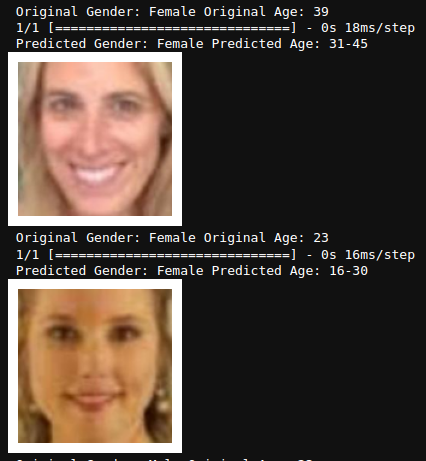

# Gender and Age Detection System


## Overview

The UTKFace dataset is a large-scale facial dataset featuring a wide age range (0 to 116 years old). It includes over 20,000 face images annotated with age, gender, and ethnicity. This dataset exhibits significant variation in pose, facial expression, illumination, occlusion, and resolution, making it suitable for various tasks such as face detection, age estimation, age progression/regression, and landmark localization.

## Objective

The goal of this project is to develop a Convolutional Neural Network (CNN) to predict the age and gender of faces from the UTKFace dataset. The project involves analyzing the accuracy and loss of the CNN model and testing the trained model on several example images to evaluate its performance.

## Steps

The project is divided into the following steps:

1. **Import Libraries**
   - Import necessary libraries and dependencies for data processing and model building.

2. **Dataset Summary**
   - Load and explore the UTKFace dataset to understand its structure and contents.

3. **Map Gender Labels**
   - Convert gender labels into numerical format for use in the CNN model.

4. **Visualization**
   - Visualize a sample of images from the dataset to understand variations and patterns.

5. **Feature Extraction**
   - Preprocess images to extract features suitable for training the CNN model.

6. **Model Architecture**
   - Define the architecture of the CNN, including layers and activation functions.

7. **Compile Model**
   - Configure the model with appropriate loss functions, optimizers, and metrics.

8. **Train the Model**
   - Train the CNN model on the dataset, monitoring accuracy and loss metrics.

9. **Image Prediction**
   - Use the trained model to predict the age and gender of faces in example images.

## Installation

To get started, clone the repository and install the required packages:

```bash
git clone https://github.com/Umair98392/Gender_and_Age_Detection_System.git
cd Gender_and_Age_Detection_System
